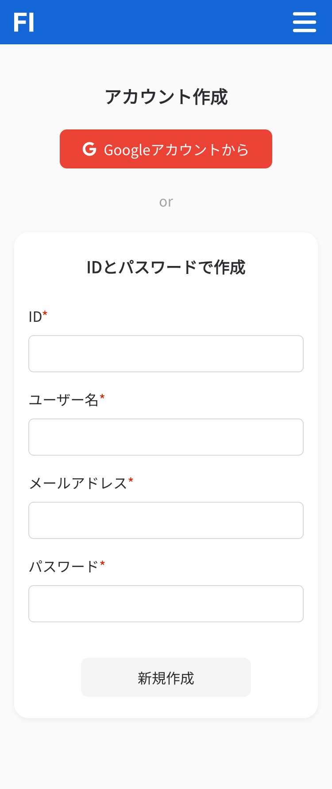
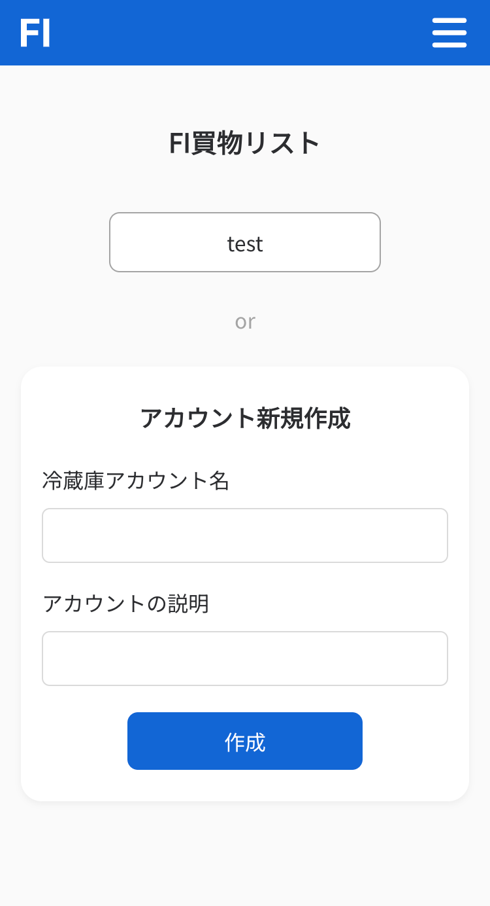
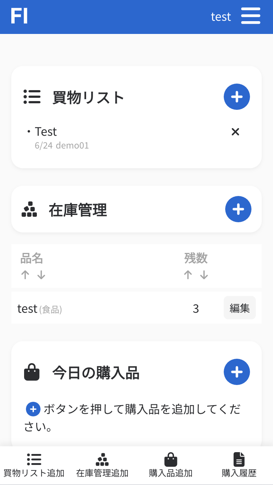
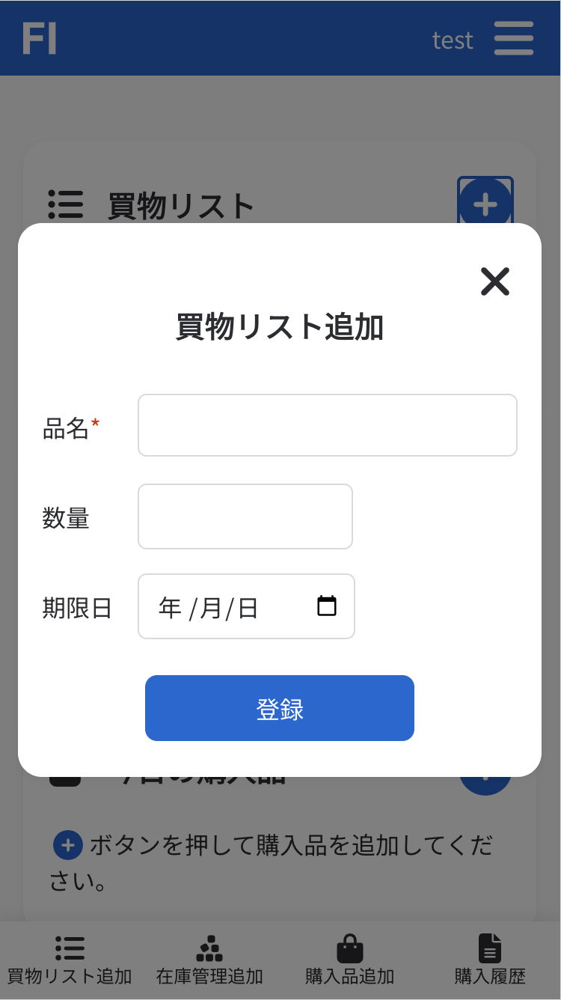
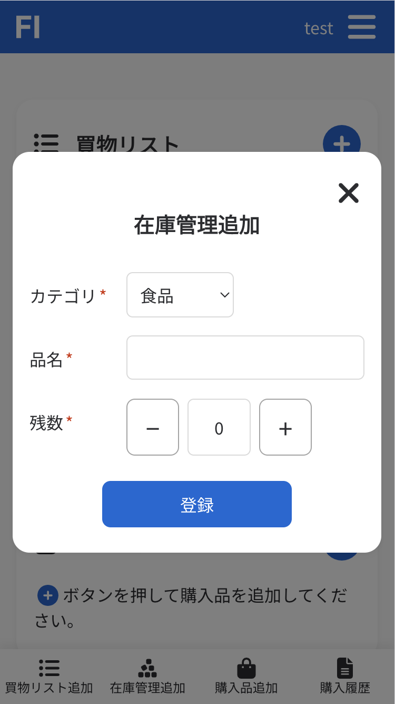
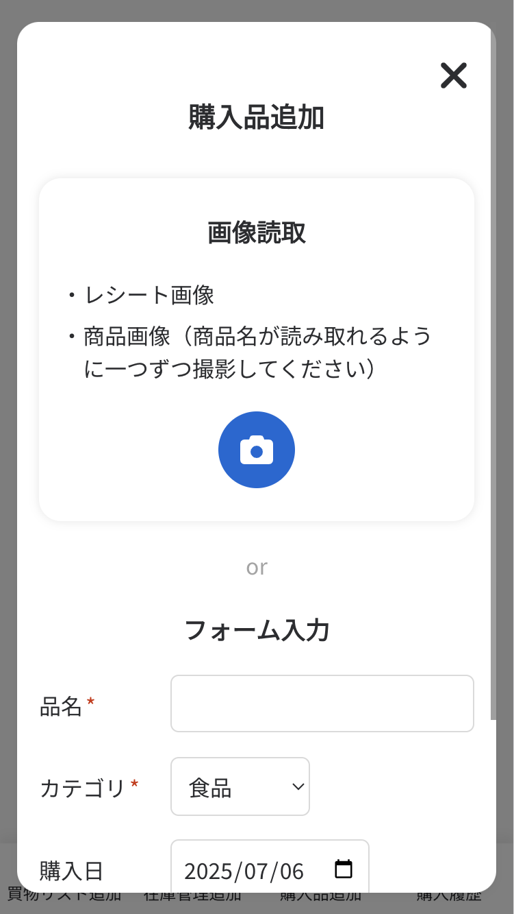
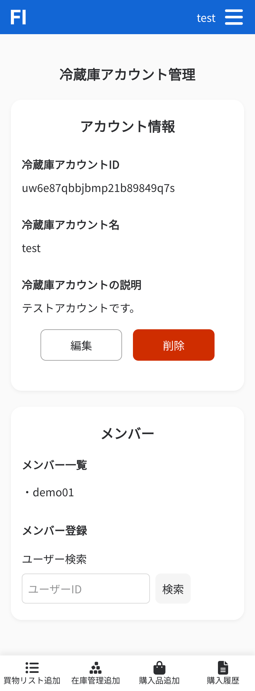
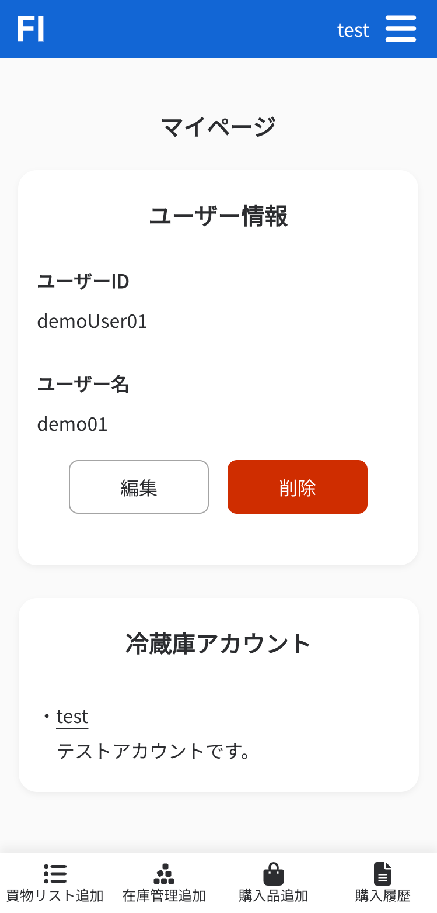
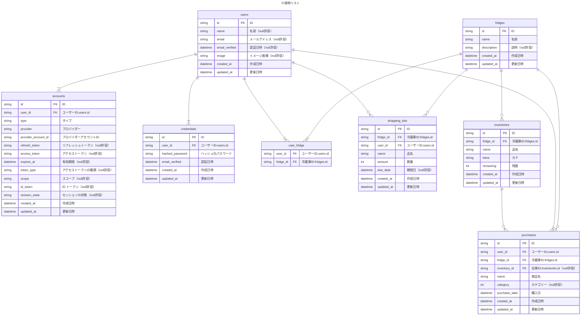

# FI 買物リスト

常備品等の在庫管理ができる買い物リストアプリです。
主に、買物リスト追加、在庫管理追加・編集、購入品追加の 3 つの機能で構成されています。

## デモ

https://fi-shopping-list.vercel.app  
ID:demoUser01  
password:demopassword

## 利用シーン

- 日常的には買い物リストとして手軽に利用でき、必要に応じて在庫管理や購入商品の登録も可能です。
- 介護の現場では、被介護者・家族（子どもや兄弟）・介護職員など、複数人が関わる冷蔵庫の管理に活用できます。
- 冷蔵庫アカウントを複数作成できるため、「被介護者宅用」「自宅用」など、用途ごとに冷蔵庫を分けて管理することができます。

## 利用の流れ

### 1.ユーザーアカウントを作成

まずは、サービス利用のためのユーザーアカウントを作成します。

### 2.冷蔵庫アカウントを作成

家庭や施設などの単位で管理できる「冷蔵庫アカウント」を作成します。1 ユーザーで複数の冷蔵庫を管理可能です。

### 3.冷蔵庫アカウントのトップページから操作

  

  
  
冷蔵庫アカウントごとのトップページで、以下の操作を行えます：

- 「買い物リスト」の登録・削除
   

- 「在庫管理」の登録・編集・削除
   

- 「購入品」の登録・削除  
   購入品の登録はレシート画像/商品画像読み取りもしくはフォーム入力で行います。
   

### 4.冷蔵庫アカウントの管理

冷蔵庫アカウント管理画面で以下の操作が行えます：

- 冷蔵庫アカウントの ID や名称、概要を編集
- 他のユーザーを冷蔵庫アカウントに登録

### 5.ユーザーアカウントの管理

ユーザー ID やユーザーアカウント名の編集が行えます。

## 構成・デザイン

https://www.figma.com/design/cuPqO3vASUV9tXxA2tcgJo/FI%E8%B2%B7%E7%89%A9%E3%83%AA%E3%82%B9%E3%83%88-v1

## ER 図

## 使用技術

- **Framework**: Next.js (v15)
- **Language**: TypeScript, React 19
- **Styling**: Tailwind CSS v4, tailwind-variants, tailwind-merge
- **Form**: React Hook Form, Zod, @hookform/resolvers
- **Authentication**: NextAuth.js + Prisma Adapter
- **Backend / Database**: Prisma ORM, Neon Serverless
- **Security**: bcryptjs, jsonwebtoken
- **Email**: Nodemailer
- **Icons / UI**: React Icons, React Spinners
- **Utilities**: clsx, cuid2
- **AI Integration**: OpenAI Node.js SDK

### 開発支援ツール

- ESLint
- TypeScript
- Prisma CLI
- Next.js Lint
- Tailwind CSS with PostCSS
